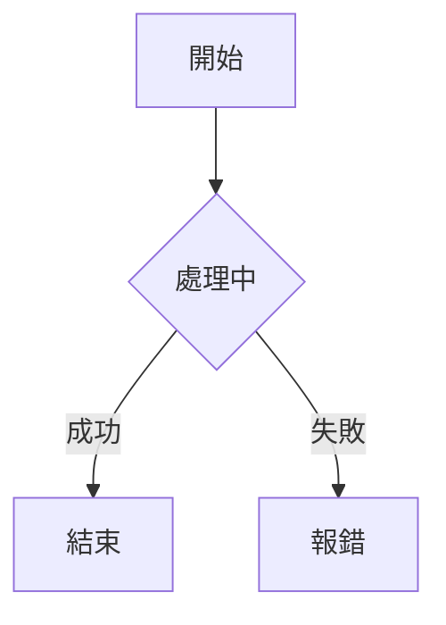

###### tags: `AI`

# Markdown 語法速查 (Markdown Cheat Sheet)

[toc]

歡迎來到 Markdown 的世界！這是一種輕量級標記語言，也是 **AI (LLM) 輸出的標準格式**。
學會 Markdown，不僅能讓你快速撰寫技術文件，更能讓你與 AI 的溝通（Prompting & Reading）更加順暢。

---

## 1. 標題 (Headers)
使用 `#` 符號的數量來決定標題層級。

```markdown
# H1 大標題 (通常用於文件主標題)
## H2 次標題 (章節)
### H3 小標題 (子章節)
#### H4 ...
```

---

## 2. 文字樣式 (Text Styling)

| 效果 | 語法範例 | 說明 |
| :--- | :--- | :--- |
| **粗體** | `**粗體文字**` | 使用兩個星號包裹 |
| *斜體* | `*斜體文字*` | 使用一個星號包裹 |
| ~~刪除線~~ | `~~刪除線~~` | 使用兩個波浪號 |
| `行內程式碼` | \`變數 name\` | 使用反引號 (鍵盤左上角)，適合強調變數或路徑 |

---

## 3. 列表 (Lists)

### 無序列表 (Unordered List)
使用 `-` 或 `*` 加上一個空白鍵。

```markdown
- 項目 A
- 項目 B
  - 子項目 (按 Tab 縮排)
  - 子項目
```

### 有序列表 (Ordered List)
使用數字加點 `1.`。

```markdown
1. 第一步：打開電腦
2. 第二步：開啟瀏覽器
```

### 待辦清單 (Task List)
適合用來追蹤進度。

```markdown
- [ ] 尚未完成的任務
- [x] 已完成的任務
```

---

## 4. 程式碼區塊 (Code Blocks) *工程師必學*
使用三個反引號 \`\`\` 包裹程式碼，並可指定語言以啟用語法高亮 (Syntax Highlighting)。

**C# 範例：**

````markdown
```csharp
public class HelloWorld
{
    public void SayHi()
    {
        Console.WriteLine("Hello Markdown!");
    }
}
```
````

**JSON 範例：**

````markdown
```json
{
  "name": "AI 小旺",
  "version": "1.0"
}
```
````

---

## 5. 引用與連結

*   **引用區塊**：使用 `>` 開頭。
    ```markdown
    > 這是引用自官方文件的說明...
    ```
*   **超連結**：`顯示文字`
    ```markdown
    [Google](https://www.google.com)
    ```
*   **圖片**：`!圖片描述` (比連結多一個驚嘆號)
    ```markdown
    
    ```

---

## 6. 進階：Mermaid 圖表
HedgeDoc 支援直接渲染 Mermaid 語法。
*小撇步：不需要背語法，請直接叫 AI 幫你畫！*

````markdown

````